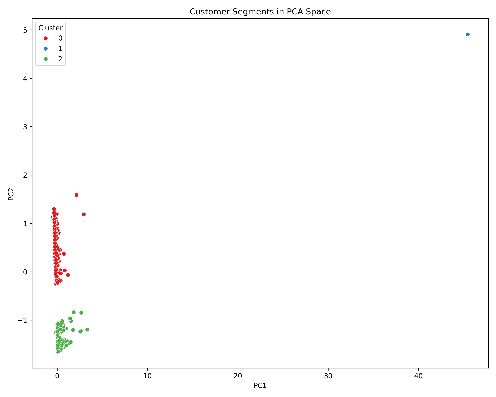
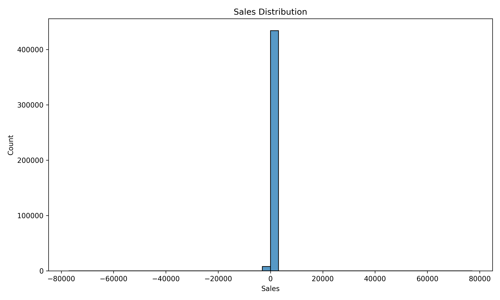
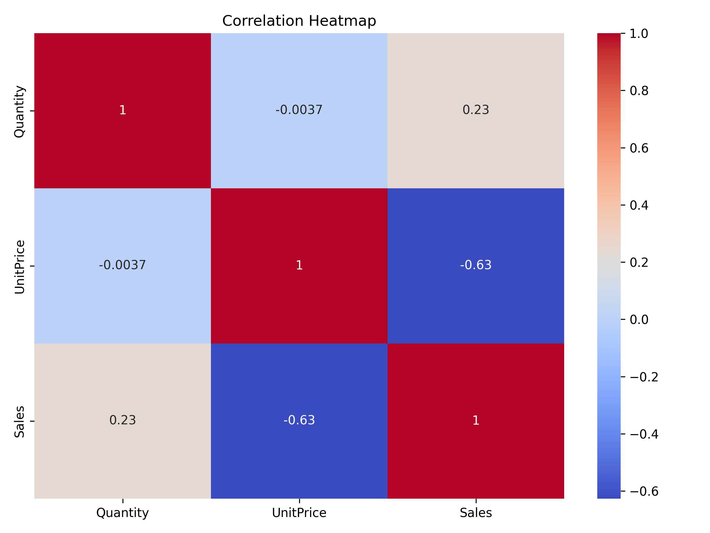
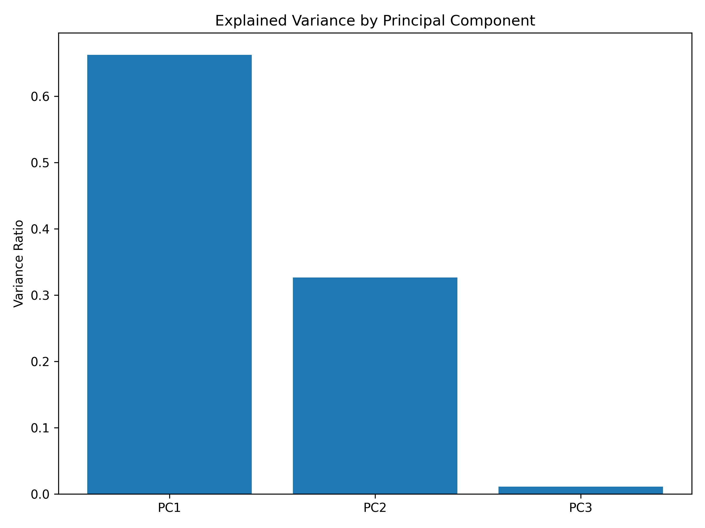
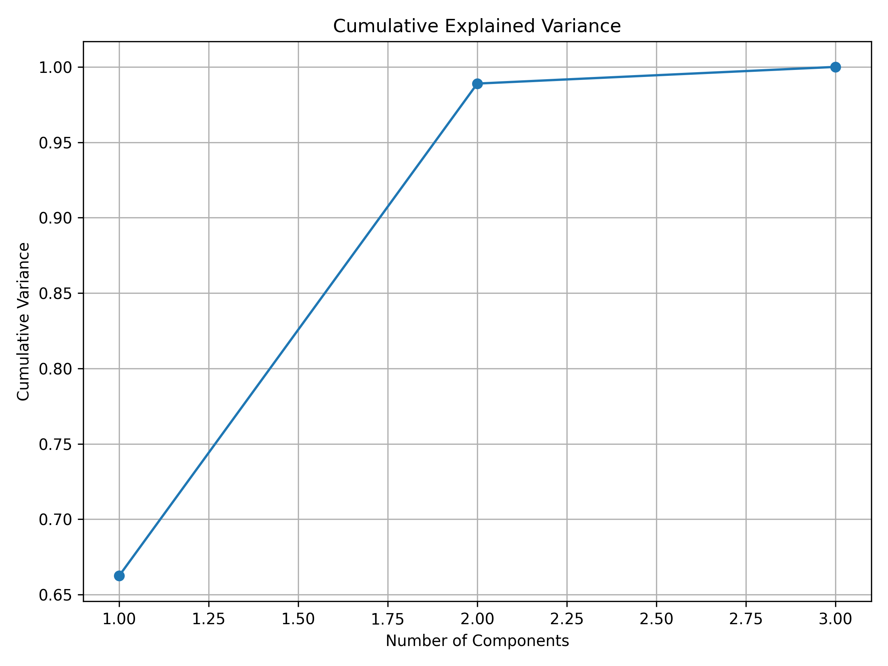
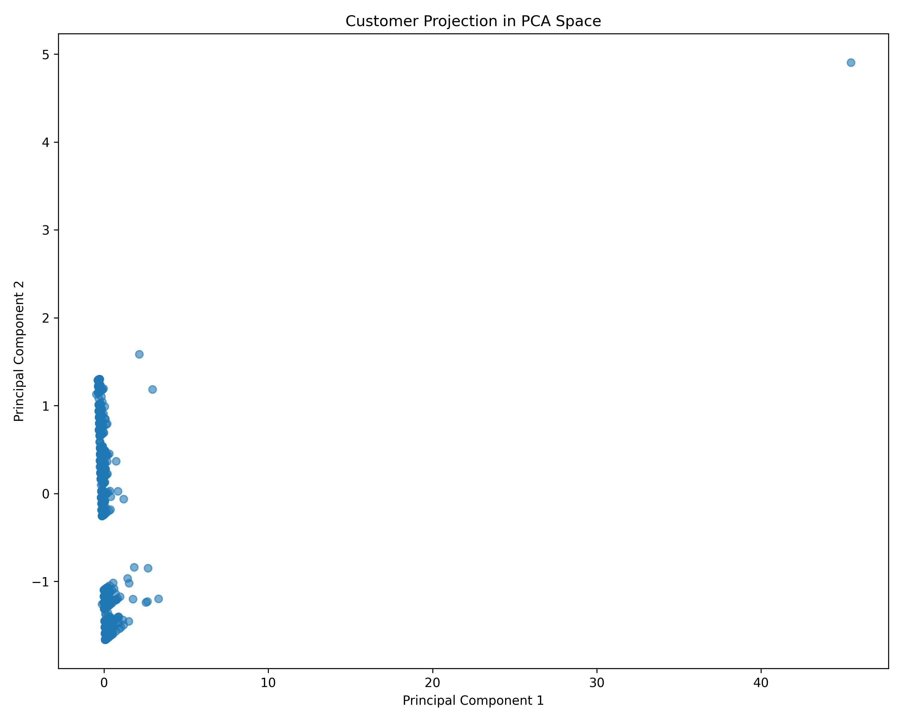
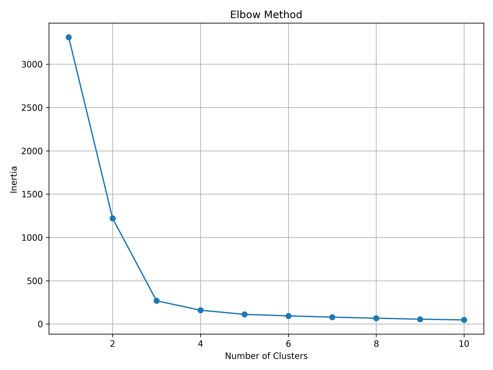
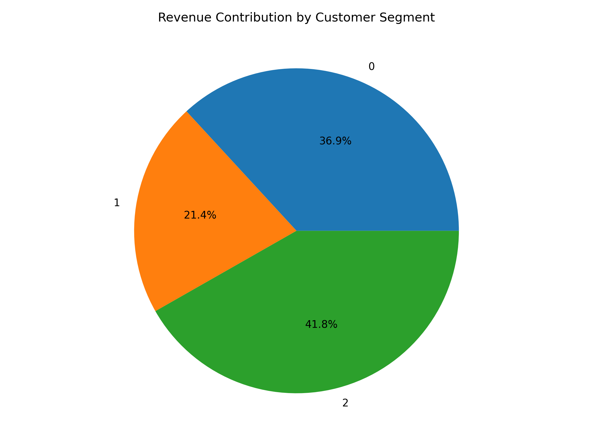
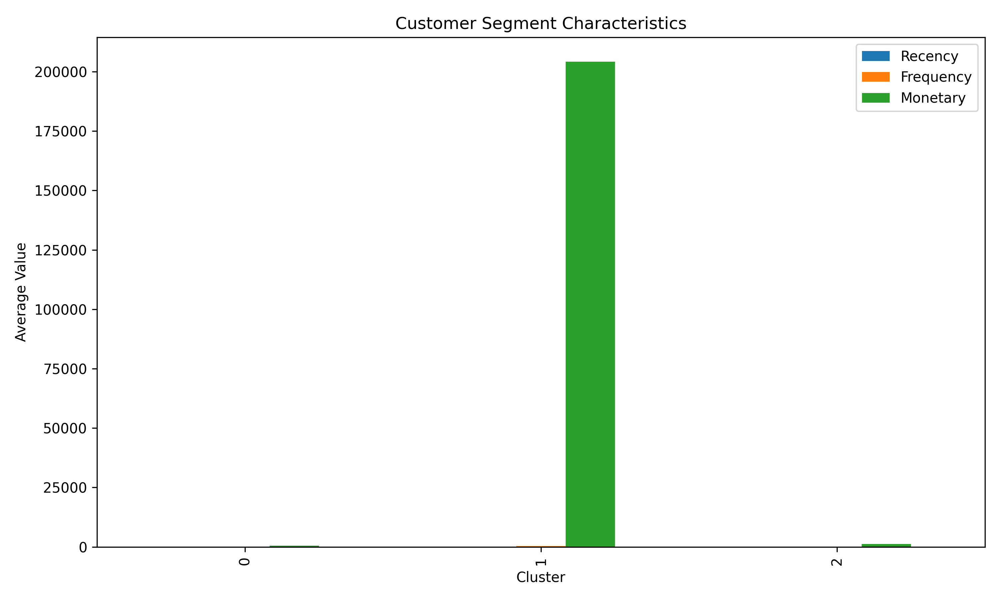

# Statistical Customer Segmentation System



## Overview

The Statistical Customer Segmentation System is a comprehensive statistical learning and data mining project designed to uncover hidden patterns in customer purchasing behavior using advanced analytical techniques.

Using transactional retail data containing over **442,000 cleaned purchase records** and **1,104 unique customers**, the project applies exploratory data analysis, customer behavior modeling, dimensionality reduction, clustering algorithms, and cluster evaluation methods to identify meaningful customer segments and support data-driven business decision-making.

The framework demonstrates how statistical learning techniques can transform large-scale transactional data into actionable customer intelligence.

---

## Project Objectives

* Analyze customer purchasing behavior
* Explore transaction and sales patterns
* Develop Recency-Frequency-Monetary (RFM) customer profiles
* Apply dimensionality reduction techniques
* Identify latent customer segments using clustering
* Evaluate segmentation quality using statistical metrics
* Generate actionable customer insights
* Support data-driven marketing and customer relationship strategies

---

## Research Question

**Can statistical learning and customer behavior modeling techniques effectively identify meaningful customer segments within large-scale retail transaction data?**

---

# Dataset

This project uses the Online Retail transactional dataset containing customer purchase records from a UK-based retailer.

## Dataset Characteristics

| Metric                 |   Value |
| ---------------------- | ------: |
| Original Records       | 446,121 |
| Records After Cleaning | 442,251 |
| Unique Customers       |   1,104 |
| Variables              |       8 |
| Countries Represented  |     30+ |

---

## Key Variables

* CustomerID
* Invoice Number
* Product Description
* Quantity Purchased
* Unit Price
* Invoice Date
* Country
* Sales Revenue

---

# Methodology

## 1. Data Cleaning and Preparation

The dataset underwent extensive preprocessing including:

* Missing value assessment
* Duplicate removal
* Sales calculation
* Transaction validation
* Customer-level aggregation

### Data Quality Assessment

| Variable    | Missing Values |
| ----------- | -------------: |
| Description |          1,371 |
| Quantity    |              1 |
| UnitPrice   |              1 |
| CustomerID  |              1 |

A total of **3,870 duplicate transactions** were identified and removed.

---

## 2. Exploratory Data Analysis

Exploratory analysis examined:

* Customer spending behavior
* Country-level transaction activity
* Variable distributions
* Correlation structures

### Sales Distribution



Transaction-level sales were highly right-skewed, indicating the presence of large purchases and substantial spending variability.

---

## 3. Customer Behavior Modeling

Customer-level behavioral profiles were constructed using the RFM framework:

### Recency

Time since most recent purchase.

### Frequency

Number of purchase transactions.

### Monetary

Total customer spending.

---

## RFM Summary Statistics

| Metric  | Recency | Frequency |    Monetary |
| ------- | ------: | --------: | ----------: |
| Mean    |   24.30 |      2.31 |     £865.03 |
| Median  |   28.50 |      1.00 |     £318.62 |
| Maximum |      43 |       399 | £204,223.96 |

These statistics reveal substantial heterogeneity in customer purchasing behavior.

---

## 4. Correlation Analysis

### RFM Correlation Structure



| Variables            | Correlation |
| -------------------- | ----------: |
| Recency ↔ Frequency  |      -0.099 |
| Recency ↔ Monetary   |      -0.103 |
| Frequency ↔ Monetary |       0.967 |

### Key Finding

Frequency and Monetary Value exhibited an exceptionally strong positive relationship:

```text
Correlation = 0.967
```

Customers who purchased more frequently also spent substantially more.

---

## 5. Principal Component Analysis (PCA)

To reduce dimensional complexity while preserving information, Principal Component Analysis was applied.

### Explained Variance



| Component | Variance Explained |
| --------- | -----------------: |
| PC1       |             66.25% |
| PC2       |             32.64% |
| PC3       |              1.11% |

### Cumulative Variance



The first two principal components retained:

```text
98.89% of total information
```

This indicates that customer behavior can be effectively represented in two dimensions.

---

## Customer Projection in PCA Space



PCA revealed that customer behavior is largely governed by two latent dimensions:

* Customer Value
* Customer Activity Recency

---

## 6. Customer Segmentation

### Elbow Method



The Elbow Method supported a three-cluster solution.

---

## Customer Segments


K-Means clustering successfully identified distinct customer groups.

### Outlier-Adjusted Segmentation Results

| Segment              | Customers | Percentage |
| -------------------- | --------: | ---------: |
| Occasional Customers |       756 |      68.5% |
| Active Customers     |       334 |      30.3% |
| High-Value Customers |        13 |       1.2% |

---

## Customer Personas

### Occasional Customers

| Metric    |   Value |
| --------- | ------: |
| Recency   |   33.05 |
| Frequency |    1.50 |
| Monetary  | £370.27 |

Characteristics:

* Infrequent purchases
* Low spending levels
* Long periods of inactivity

---

### Active Customers

| Metric    |   Value |
| --------- | ------: |
| Recency   |    5.09 |
| Frequency |    2.47 |
| Monetary  | £948.69 |

Characteristics:

* Recently active
* Consistent purchasing behavior
* Core customer base

---

### High-Value Customers

| Metric    |      Value |
| --------- | ---------: |
| Recency   |      10.77 |
| Frequency |      14.69 |
| Monetary  | £11,844.76 |

Characteristics:

* Extremely valuable
* Frequent purchasers
* Significant revenue contributors

---

## Cluster Evaluation

### Silhouette Score

```text
0.737
```

Interpretation:

* Excellent cluster separation
* Strong customer differentiation
* High segmentation quality

This result provides strong statistical evidence that meaningful customer groups exist within the data.

---

## Revenue Contribution Analysis



Although High-Value Customers represented only approximately **1.2%** of customers, they contributed a disproportionately large share of total revenue.

This finding highlights the importance of customer retention and targeted engagement strategies.

---

## Customer Segment Characteristics



The customer segments differ substantially across recency, frequency, and spending behavior, demonstrating clear behavioral separation.

---

# Key Findings

### Finding 1

Customer purchasing behavior is highly heterogeneous.

### Finding 2

A strong positive relationship exists between purchasing frequency and spending behavior.

### Finding 3

Two principal components explained approximately **98.9%** of customer behavioral variation.

### Finding 4

Customer segmentation identified three statistically distinct customer groups.

### Finding 5

A small number of customers generate disproportionately large revenue contributions.

### Finding 6

The clustering solution achieved an excellent Silhouette Score of **0.737**, indicating strong cluster validity.

---

# Research Question Answered

The results demonstrate that statistical learning techniques can effectively identify meaningful customer segments within large-scale retail transaction data.

Through RFM modeling, Principal Component Analysis, and clustering methods, customer behavior was successfully transformed into interpretable customer personas that can support marketing, customer retention, and business intelligence initiatives.

---

# Technologies

* Python
* Pandas
* NumPy
* Matplotlib
* Seaborn
* Scikit-Learn
* SciPy
* Jupyter Notebook

---

# Project Structure

```text
statistical-customer-segmentation-system/
│
├── data/
├── image/
│
├── notebooks/
│   ├── 01_data_collection.ipynb
│   ├── 02_exploratory_analysis.ipynb
│   ├── 03_rfm_analysis.ipynb
│   ├── 04_dimensionality_reduction.ipynb
│   ├── 05_clustering.ipynb
│   └── 06_cluster_evaluation_and_business_insights.ipynb
│
├── README.md
├── requirements.txt
└── LICENSE
```

---

# Statistical Techniques Demonstrated

* Exploratory Data Analysis
* Customer Analytics
* RFM Modeling
* Correlation Analysis
* Principal Component Analysis
* Dimensionality Reduction
* K-Means Clustering
* Hierarchical Clustering
* Silhouette Evaluation
* Statistical Learning
* Data Mining
* Customer Segmentation

---

# Portfolio Relevance

This project demonstrates practical applications of:

* Statistical Learning and Data Mining
* Computational Statistics
* High-Dimensional Statistical Modeling
* Unsupervised Machine Learning
* Customer Analytics
* Business Intelligence
* Data-Driven Decision Making

---

# Future Enhancements

* Bayesian customer segmentation
* Gaussian mixture models
* Customer lifetime value prediction
* Churn prediction modeling
* Interactive dashboard deployment
* Real-time customer monitoring
* Deep learning customer embeddings

  ---

# References

1. Han, J., Kamber, M., & Pei, J. (2022). *Data Mining: Concepts and Techniques* (4th ed.). Morgan Kaufmann.

2. James, G., Witten, D., Hastie, T., & Tibshirani, R. (2021). *An Introduction to Statistical Learning with Applications in R* (2nd ed.). Springer.

3. Hastie, T., Tibshirani, R., & Friedman, J. (2017). *The Elements of Statistical Learning*. Springer.

4. Jolliffe, I. T. (2002). *Principal Component Analysis* (2nd ed.). Springer.

5. Kaufman, L., & Rousseeuw, P. J. (2009). *Finding Groups in Data: An Introduction to Cluster Analysis*. Wiley.

6. Pedregosa, F., Varoquaux, G., Gramfort, A., Michel, V., Thirion, B., Grisel, O., et al. (2011). Scikit-Learn: Machine Learning in Python. *Journal of Machine Learning Research*, 12, 2825–2830.

7. McKinney, W. (2022). *Python for Data Analysis* (3rd ed.). O'Reilly Media.

8. Online Retail Dataset. UCI Machine Learning Repository. Available at:
   https://archive.ics.uci.edu/ml/datasets/online+retail

9. Scikit-Learn Documentation:
   https://scikit-learn.org

10. Pandas Documentation:
    https://pandas.pydata.org

---

# Author

**Clement Kofi Okyere Biew**

Statistics | Data Science | Statistical Learning | Computational Statistics | Machine Learning | Quantitative Research
